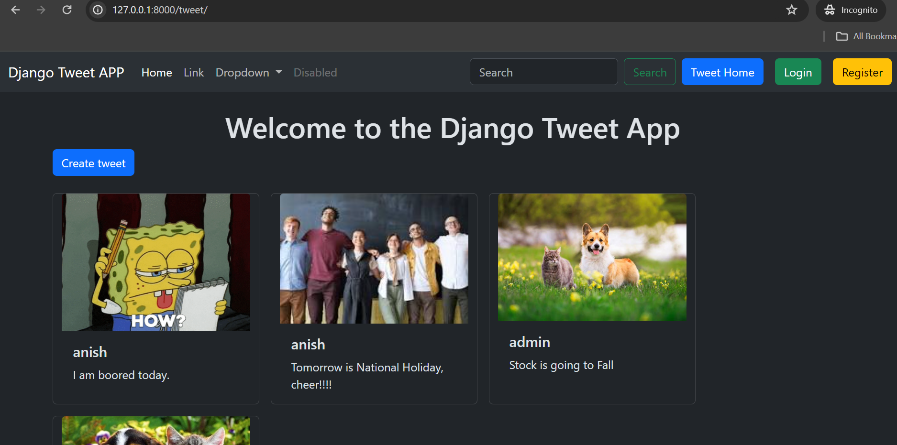
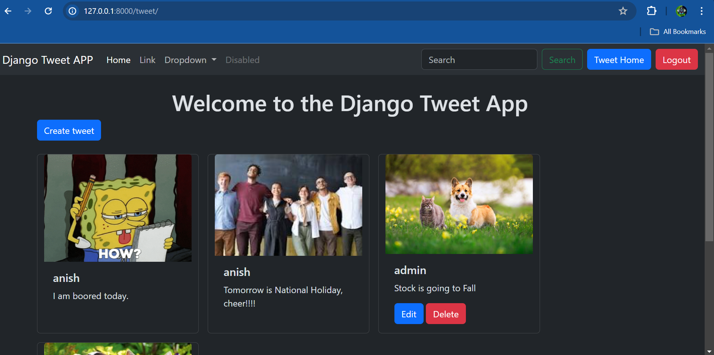

# Django-Tweet-App (CRUD Functionality) 

## Overview
This project is a simple Twitter-like application built with Django. It allows users to create, read, update, and delete tweets. The app supports both authenticated and unauthenticated user views.

## Features
- **Un-authenticated User View**: Allows unauthenticated users to view tweets.

- **Authenticated User View**: Allows authenticated users to create, update, and delete their tweets.

## Technology Stack
- Django
- SQLite (for development)
- Bootstrap for styling

## Getting Started

### Prerequisites
- Python 3.8 or higher
- pip

### Installation
1. Clone the repository:
git clone https://github.com/yourusername/simple-django-tweet-app.git 

2. Navigate to the project directory: 
cd simple-django-tweet-app

3. Install the requirements: 
pip install -r requirements.txt

4. Run the migrations:
python manage.py migrate 

5. Start the development server:
python manage.py runserver

6. Open a browser and go to `http://127.0.0.1:8000/` to see the application in action.

## How to Use
- Visit the homepage to see all tweets.
- Log in or sign up to create, edit, or delete tweets.

## Contributing
Contributions are welcome! Please feel free to submit a pull request.

## License
This project is open source and available under the [MIT License](LICENSE).
